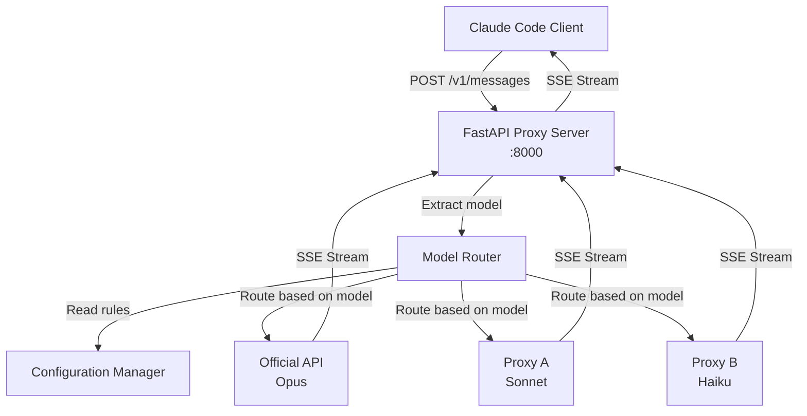
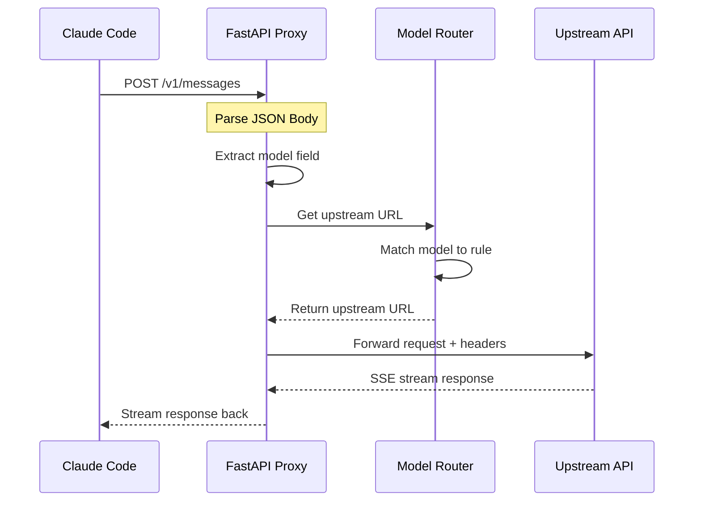

# Design Document

## Overview

本项目是一个基于 FastAPI 的智能代理路由器，用于根据 Claude 模型类型将请求路由到不同的上游服务器。系统采用异步架构，特别优化了 SSE（Server-Sent Events）流式响应的处理，确保与 Claude Code 的无缝集成。

核心设计理念：
- **透明代理**：对客户端完全透明，保持原始请求和响应的完整性
- **高性能异步**：使用 async/await 模式处理并发请求
- **配置驱动**：通过配置文件灵活管理路由规则
- **流式优先**：原生支持 SSE 流式传输

## Architecture

### 系统架构图



### 请求处理流程



## Components and Interfaces

### 1. FastAPI Application (`main.py`)

**职责**：
- 创建 FastAPI 应用实例
- 配置中间件（日志、CORS 等）
- 注册路由处理器
- 管理应用生命周期

**关键接口**：
```python
app = FastAPI(title="Claude Proxy Router")

@app.post("/{path:path}")
async def proxy_request(
    path: str,
    request: Request,
    body: dict = Body(...)
) -> Response:
    """
    拦截所有 POST 请求并转发到相应的上游服务器
    
    Args:
        path: 请求路径（如 "v1/messages"）
        request: 原始请求对象
        body: 解析后的 JSON 请求体
    
    Returns:
        来自上游服务器的响应（支持流式）
    
    Flow:
        1. 从 body 中提取 model 字段
        2. 使用 router.get_upstream_url(model) 获取上游 URL
        3. 使用 router.get_api_key(model) 获取 API 密钥
        4. 调用 client.forward_request() 转发请求（传入 api_key）
        5. 流式返回响应
    """
```

### 2. Model Router (`router.py`)

**职责**：
- 根据模型名称匹配路由规则
- 返回对应的上游 URL
- 支持通配符匹配

**关键接口**：
```python
class ModelRouter:
    def __init__(self, config: Config):
        """
        初始化路由器
        
        Args:
            config: 配置管理器实例
        """
        pass
    
    def get_upstream_url(self, model: str) -> str:
        """
        根据模型名称获取上游 URL
        
        Args:
            model: 模型名称（如 "claude-3-opus-20240229"）
        
        Returns:
            匹配的上游 URL，若无匹配则返回默认 URL
        
        Example:
            >>> router.get_upstream_url("claude-3-opus-20240229")
            "https://api.anthropic.com"
        """
        pass
    
    def get_api_key(self, model: str) -> Optional[str]:
        """
        根据模型名称获取对应的 API 密钥
        
        Args:
            model: 模型名称
        
        Returns:
            API 密钥，若无匹配则返回默认密钥
        
        Example:
            >>> router.get_api_key("claude-3-opus-20240229")
            "sk-ant-xxx"
        """
        pass
    
    def add_route(self, pattern: str, upstream_url: str, api_key: Optional[str] = None):
        """添加路由规则"""
        pass
```

### 3. Upstream Client (`client.py`)

**职责**：
- 使用 httpx 发送异步 HTTP 请求
- 处理 SSE 流式响应
- 管理连接池和超时

**关键接口**：
```python
class UpstreamClient:
    def __init__(self, timeout: float = 30.0):
        """
        初始化上游客户端
        
        Args:
            timeout: 请求超时时间（秒）
        """
        pass
    
    async def forward_request(
        self,
        method: str,
        url: str,
        headers: dict,
        body: dict,
        api_key: Optional[str] = None
    ) -> AsyncIterator[bytes]:
        """
        转发请求到上游服务器并流式返回响应
        
        Args:
            method: HTTP 方法
            url: 目标 URL
            headers: 原始请求头
            body: 请求体
            api_key: 上游 API 密钥（如果提供，将替换 Authorization 头）
        
        Yields:
            响应数据块（支持 SSE 流）
        
        Raises:
            UpstreamError: 上游服务器错误
        
        Note:
            - 如果 api_key 参数提供，将设置 Authorization 头为 "Bearer {api_key}"
            - 否则保留原始请求头中的 Authorization
        """
        pass
    
    async def close(self):
        """关闭连接池"""
        pass
```

### 4. Configuration Manager (`config.py`)

**职责**：
- 加载和解析配置文件
- 管理环境变量
- 验证配置有效性

**关键接口**：
```python
@dataclass
class RouteRule:
    pattern: str  # 模型匹配模式（支持通配符）
    upstream_url: str  # 上游 URL
    api_key: Optional[str] = None  # 上游 API密钥（可选，优先使用环境变量）
    api_key_env: Optional[str] = None  # API 密钥的环境变量名

@dataclass
class Config:
    default_upstream: str
    default_api_key: Optional[str] = None  # 默认 API 密钥
    routes: List[RouteRule]
    log_level: str = "INFO"
    port: int = 8000
    
    @classmethod
    def from_file(cls, config_path: str = "config.yaml") -> "Config":
        """
        从 YAML 文件加载配置
        
        Args:
            config_path: 配置文件路径
        
        Returns:
            配置对象
        
        Raises:
            ConfigError: 配置文件错误
        """
        pass
    
    @classmethod
    def from_env(cls) -> "Config":
        """从环境变量加载配置"""
        pass
```

### 5. Logger (`logger.py`)

**职责**：
- 配置 structlog 结构化日志
- 支持不同日志级别和输出格式
- 记录请求/响应信息 with 上下文
- 支持 JSON 格式输出（便于日志聚合）

**关键接口**：
```python
import structlog

def setup_logging(level: str = "INFO", json_format: bool = False) -> structlog.BoundLogger:
    """
    配置 structlog 日志系统
    
    Args:
        level: 日志级别 (DEBUG, INFO, WARNING, ERROR)
        json_format: 是否使用 JSON 格式输出（生产环境推荐）
    
    Returns:
        配置好的 structlog logger 实例
    
    Example:
        >>> logger = setup_logging("INFO", json_format=True)
        >>> logger.info("request_received", model="claude-3-opus", path="/v1/messages")
    """
    pass

def get_logger(name: str = __name__) -> structlog.BoundLogger:
    """
    获取 logger 实例
    
    Args:
        name: logger 名称
    
    Returns:
        structlog logger 实例
    """
    pass

def log_request(
    logger: structlog.BoundLogger,
    model: str,
    upstream_url: str,
    status_code: int,
    duration: float,
    **kwargs
):
    """
    记录请求处理信息
    
    Args:
        logger: structlog logger 实例
        model: 模型名称
        upstream_url: 上游 URL
        status_code: HTTP 状态码
        duration: 处理时长（秒）
        **kwargs: 额外的上下文信息
    
    Example:
        >>> log_request(
        ...     logger,
        ...     model="claude-3-opus",
        ...     upstream_url="https://api.anthropic.com",
        ...     status_code=200,
        ...     duration=1.23,
        ...     request_id="abc-123"
        ... )
    """
    pass
```

**日志输出示例**：

```json
{
    "event": "request_processed",
    "model": "claude-3-opus-20240229",
    "upstream_url": "https://api.anthropic.com",
    "status_code": 200,
    "duration": 1.234,
    "request_id": "abc-123",
    "timestamp": "2024-01-15T10:30:45.123Z",
    "level": "info"
}
```

## Data Models

### 配置文件结构 (`config.yaml`)

```yaml
# 默认上游 URL（当模型不匹配任何规则时使用）
default_upstream: "https://api.anthropic.com"
# 默认 API密钥（可选，也可以从环境变量读取）
# default_api_key: "sk-ant-xxx"
default_api_key_env: "ANTHROPIC_API_KEY"  # 从环境变量读取

# 服务器配置
server:
  host: "0.0.0.0"
  port: 8000

# 日志配置
logging:
  level: "INFO"  # DEBUG, INFO, WARNING, ERROR
  format: "json"  # "json" 或 "console"（开发环境推荐 console，生产环境推荐 json）

# 路由规则（按顺序匹配）
routes:
  # Opus 模型 -> 官方 API
  - pattern: "claude-3-opus*"
    upstream_url: "https://api.anthropic.com"
    # api_key: "sk-ant-xxx"  # 直接配置（不推荐）
    api_key_env: "ANTHROPIC_API_KEY"  # 从环境变量读取（推荐）
  
  # Sonnet 模型 -> 低价代理 A
  - pattern: "claude-3-5-sonnet*"
    upstream_url: "https://proxy-a.example.com"
    api_key_env: "PROXY_A_API_KEY"
  
  # Haiku 模型 -> 代理 B
  - pattern: "claude-3-haiku*"
    upstream_url: "https://proxy-b.example.com"
    api_key_env: "PROXY_B_API_KEY"
  
  # 其他 Claude 模型
  - pattern: "claude-*"
    upstream_url: "https://backup-proxy.example.com"
    api_key_env: "BACKUP_PROXY_API_KEY"
```

### 环境变量配置 (`.env`)

```bash
# 官方 API密钥
ANTHROPIC_API_KEY=sk-ant-xxx

# 代理 A API 密钥
PROXY_A_API_KEY=sk-proxy-a-xxx

# 代理 B API 密钥
PROXY_B_API_KEY=sk-proxy-b-xxx

# 备用代理 API 密钥
BACKUP_PROXY_API_KEY=sk-backup-xxx
```

### 请求数据模型

```python
from pydantic import BaseModel
from typing import List, Dict, Any, Optional

class Message(BaseModel):
    role: str
    content: List[Dict[str, Any]]

class ClaudeRequest(BaseModel):
    model: str
    messages: List[Message]
    max_tokens: int
    stream: bool = False
    temperature: Optional[float] = None
    system: Optional[str] = None
    
    class Config:
        extra = "allow"  # 允许额外字段
```

### 响应数据模型

响应直接透传，不需要解析。但需要识别 SSE 格式：

```
event: message_start
data: {"type":"message_start","message":{"id":"msg_xxx",...}}

event: content_block_start
data: {"type":"content_block_start","index":0,...}

event: content_block_delta
data: {"type":"content_block_delta","index":0,"delta":{"type":"text_delta","text":"Hello"}}

event: message_stop
data: {}
```

## Error Handling

### 错误类型定义

```python
class ProxyError(Exception):
    """代理错误基类"""
    pass

class ConfigError(ProxyError):
    """配置错误"""
    pass

class UpstreamError(ProxyError):
    """上游服务器错误"""
    def __init__(self, message: str, status_code: int = 502):
        self.status_code = status_code
        super().__init__(message)

class RoutingError(ProxyError):
    """路由错误"""
    pass
```

### 错误处理策略

| 错误场景 | HTTP 状态码 | 处理方式 |
|---------|-----------|---------|
| 请求体无效 JSON | 400 | 返回错误详情 |
| 缺少 model 字段 | 400 | 使用默认上游 |
| 配置文件错误 | 500 | 启动失败，记录错误 |
| 上游连接失败 | 502 | 返回错误信息，记录日志 |
| 上游超时 | 504 | 返回超时错误 |
| 上游返回 4xx | 4xx | 透传错误 |
| 上游返回 5xx | 502 | 返回简化的错误信息 |

### 错误响应格式

```python
class ErrorResponse(BaseModel):
    error: str
    detail: Optional[str] = None
    type: str = "proxy_error"

# 示例
{
    "error": "Upstream connection failed",
    "detail": "Failed to connect to https://api.anthropic.com",
    "type": "proxy_error"
}
```

## Testing Strategy

### 单元测试

**测试框架**：pytest + pytest-asyncio + httpx 的测试客户端

**测试覆盖**：

1. **Model Router 测试** (`test_router.py`)
   ```python
   @pytest.mark.asyncio
   async def test_route_opus_to_official():
       """测试 Opus 模型路由到官方 API"""
       router = ModelRouter(config)
       url = router.get_upstream_url("claude-3-opus-20240229")
       assert url == "https://api.anthropic.com"
   
   @pytest.mark.asyncio
   async def test_route_sonnet_to_proxy():
       """测试 Sonnet 模型路由到代理"""
       router = ModelRouter(config)
       url = router.get_upstream_url("claude-3-5-sonnet-20241022")
       assert url == "https://proxy-a.example.com"
   
   @pytest.mark.asyncio
   async def test_route_unknown_to_default():
       """测试未知模型使用默认路由"""
       router = ModelRouter(config)
       url = router.get_upstream_url("unknown-model")
       assert url == config.default_upstream
   ```

2. **Upstream Client 测试** (`test_client.py`)
   ```python
   @pytest.mark.asyncio
   async def test_forward_request_success():
       """测试成功转发请求"""
       async with UpstreamClient() as client:
           response = await client.forward_request(
               "POST",
               "https://api.anthropic.com/v1/messages",
               headers={"Authorization": "Bearer test"},
               body={"model": "claude-3-opus", ...}
           )
           assert response is not None
   
   @pytest.mark.asyncio
   async def test_streaming_response():
       """测试流式响应处理"""
       chunks = []
       async with UpstreamClient() as client:
           async for chunk in client.forward_request(...):
               chunks.append(chunk)
       assert len(chunks) > 0
   ```

3. **Configuration 测试** (`test_config.py`)
   ```python
   def test_load_config_from_yaml():
       """测试从 YAML 加载配置"""
       config = Config.from_file("test_config.yaml")
       assert config.default_upstream == "https://api.anthropic.com"
       assert len(config.routes) > 0
   
   def test_invalid_config_raises_error():
       """测试无效配置抛出错误"""
       with pytest.raises(ConfigError):
           Config.from_file("invalid_config.yaml")
   ```

### 集成测试

**测试真实 HTTP 交互**：

```python
@pytest.mark.asyncio
async def test_full_request_flow():
    """测试完整请求流程"""
    async with httpx.AsyncClient() as client:
        response = await client.post(
            "http://localhost:8000/v1/messages",
            headers={"Authorization": "Bearer test-key"},
            json={
                "model": "claude-3-opus-20240229",
                "messages": [{"role": "user", "content": "Hello"}],
                "max_tokens": 100
            }
        )
        assert response.status_code == 200

@pytest.mark.asyncio
async def test_streaming_integration():
    """测试 SSE 流式集成"""
    async with httpx.AsyncClient() as client:
        async with client.stream(
            "POST",
            "http://localhost:8000/v1/messages",
            headers={"Authorization": "Bearer test-key"},
            json={
                "model": "claude-3-5-sonnet-20241022",
                "messages": [{"role": "user", "content": "Hello"}],
                "max_tokens": 100,
                "stream": True
            }
        ) as response:
            chunks = []
            async for chunk in response.aiter_bytes():
                chunks.append(chunk)
            assert len(chunks) > 0
```

### 性能测试

**使用 locust 进行负载测试**：

```python
from locust import HttpUser, task, between

class ProxyUser(HttpUser):
    wait_time = between(1, 3)
    
    @task
    def send_message(self):
        self.client.post(
            "/v1/messages",
            json={
                "model": "claude-3-5-sonnet-20241022",
                "messages": [{"role": "user", "content": "Test"}],
                "max_tokens": 50
            },
            headers={"Authorization": "Bearer test-key"}
        )
```

**性能目标**：
- 吞吐量：> 100 req/s
- 响应延迟增加：< 50ms（相比直接访问上游）
- 并发连接：支持 > 100 个并发流式连接

### 测试覆盖率目标

- 单元测试覆盖率：> 90%
- 关键路径覆盖：100%
- 错误处理覆盖：100%

## 项目结构

```
claude-proxy-router/
├── main.py              # FastAPI 应用入口
├── router.py            # 模型路由逻辑
├── client.py            # 上游 HTTP 客户端
├── config.py            # 配置管理
├── logger.py            # 日志配置
├── models.py            # 数据模型（可选，Pydantic）
├── errors.py            # 错误定义
├── config.yaml          # 配置文件
├── requirements.txt     # Python 依赖
├── README.md            # 项目文档
├── tests/
│   ├── __init__.py
│   ├── conftest.py      # pytest 配置和 fixtures
│   ├── test_router.py   # 路由测试
│   ├── test_client.py   # 客户端测试
│   ├── test_config.py   # 配置测试
│   └── test_integration.py  # 集成测试
└── .env.example         # 环境变量示例
```

## 技术选型理由

### FastAPI
- **异步原生支持**：完美契合 SSE 流式响应
- **高性能**：基于 Starlette 和 Pydantic，性能优异
- **自动文档**：内置 OpenAPI/Swagger UI
- **类型安全**：利用 Python 类型提示

### httpx
- **异步 HTTP 客户端**：与 FastAPI 完美配合
- **流式响应支持**：原生支持 SSE
- **连接池**：高效的连接管理
- **HTTP/2 支持**：未来可扩展

### PyYAML
- **配置文件格式**：YAML 易读易写
- **成熟稳定**：Python 标准库级别的可靠性

### structlog
- **结构化日志**：输出结构化的 JSON 日志，便于日志聚合和分析
- **上下文绑定**：支持绑定上下文信息，自动添加到所有日志
- **灵活的输出格式**：支持开发环境的人类可读格式和生产环境的 JSON 格式
- **性能优异**：异步友好的日志处理
- **丰富的处理器**：内置多种处理器用于格式化、过滤和输出

### pytest
- **异步测试支持**：通过 pytest-asyncio
- **丰富的插件生态**：coverage、mock 等
- **简洁的测试语法**：降低测试编写门槛

## 部署考虑

### 开发环境
```bash
# 安装依赖
pip install -r requirements.txt

# 运行服务
python main.py

# 或使用 uvicorn
uvicorn main:app --reload --port 8000
```

### 生产环境
```bash
# 使用 Gunicorn + Uvicorn workers
gunicorn main:app -w 4 -k uvicorn.workers.UvicornWorker --bind 0.0.0.0:8000
```

### Docker 部署
```dockerfile
FROM python:3.11-slim

WORKDIR /app
COPY requirements.txt .
RUN pip install --no-cache-dir -r requirements.txt

COPY . .

CMD ["gunicorn", "main:app", "-w", "4", "-k", "uvicorn.workers.UvicornWorker", "--bind", "0.0.0.0:8000"]
```

## 扩展性考虑

### 未来可能的扩展
1. **认证与授权**：添加 API key 验证
2. **速率限制**：防止滥用
3. **指标监控**：Prometheus metrics
4. **健康检查**：`/health` 端点
5. **配置热重载**：无需重启更新配置
6. **请求缓存**：缓存相同请求的响应
7. **负载均衡**：同一模型的多个上游负载均衡
